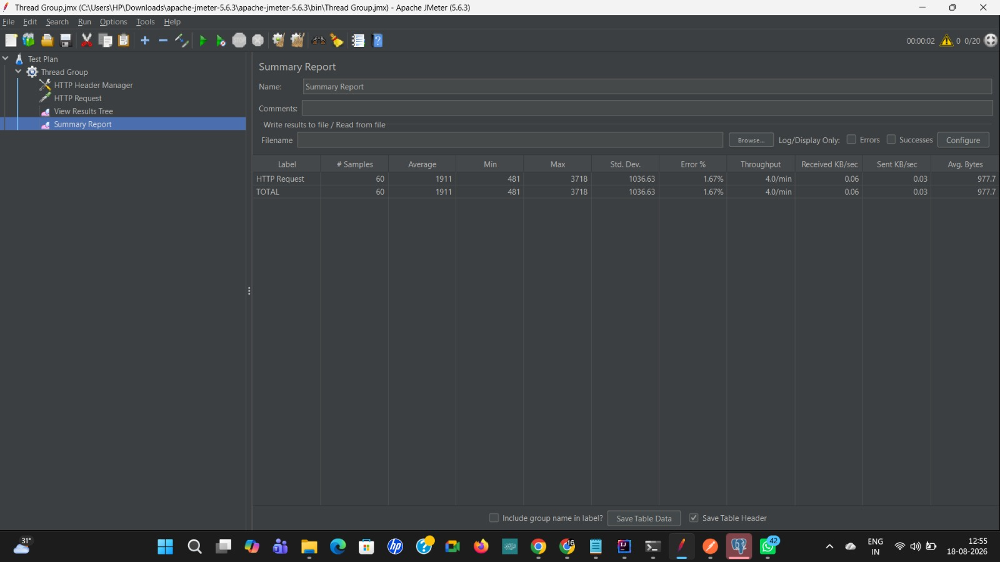
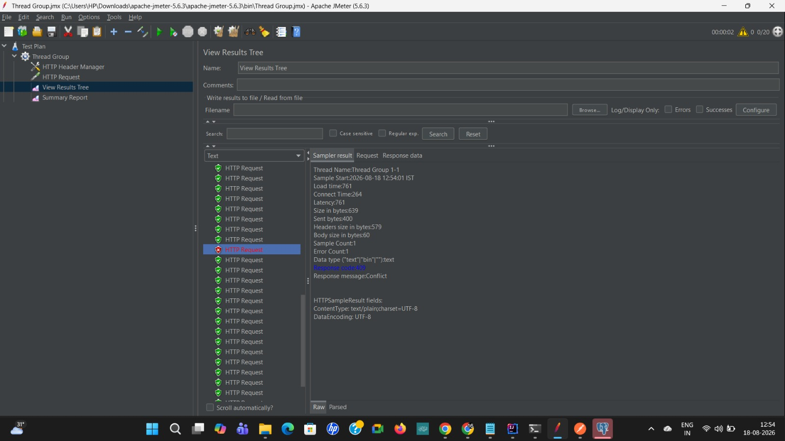
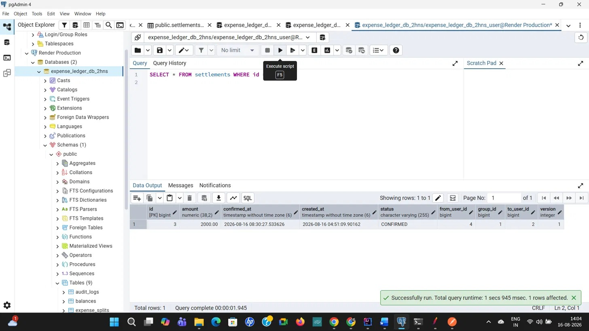
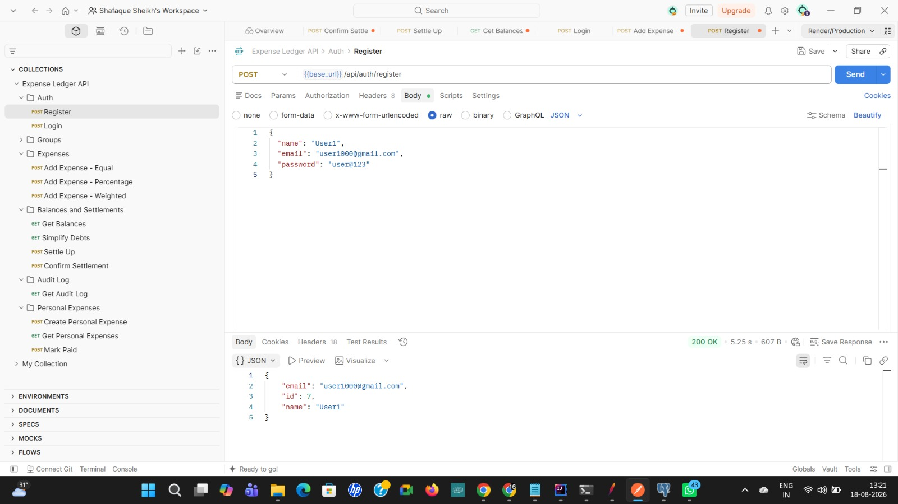
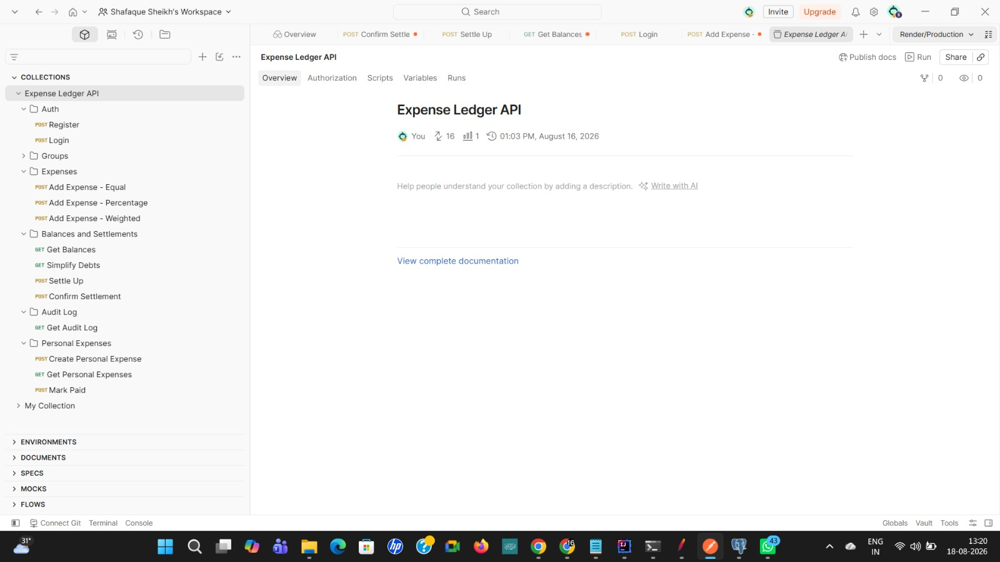
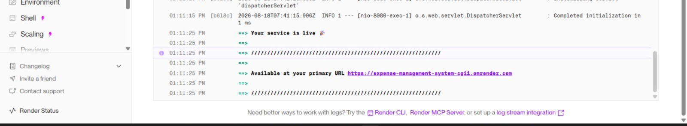

# ExpenseLedger — Expense Splitting & Ledger Management API

A full-stack expense management backend built with Java and Spring Boot — supporting group expense splitting, personal recurring expenses, debt simplification, and settlement tracking with production-grade concurrency safety.

**Live API:** `https://expense-management-system-cgi1.onrender.com`
*(Note: hosted on Render's free tier — the database resets periodically and the web service spins down after inactivity, so the first request after idle time may take ~30-50 seconds.)*

> **Visiting the URL above directly in a browser will show a 403 error — this is expected.** This is a JSON API with no public root route and no frontend yet; every endpoint except `/api/auth/**` requires a valid JWT. Use the Postman collection below (or any HTTP client with a valid token) to actually interact with the API.

---

## What this project does

ExpenseLedger solves the classic "who owes who" problem for shared living situations or group trips — think Splitwise. Users can:

- Create groups and add members
- Log expenses split three ways: **equally**, by **percentage**, or by custom **weights**
- View a running balance ledger showing exactly who owes whom
- Get a **simplified debt settlement plan** (minimum number of transactions to settle all debts in a group)
- Confirm settlements as they're paid
- Track **personal recurring expenses** (rent, subscriptions) with automatic overdue detection

---

## Tech Stack

- **Backend:** Java 21, Spring Boot 4, Spring Security, Spring Data JPA / Hibernate
- **Database:** PostgreSQL
- **Auth:** JWT (stateless, via `jjwt`)
- **Deployment:** Docker container on Render (Web Service + managed PostgreSQL)
- **Testing:** Postman (manual + collection-based), Apache JMeter (load/concurrency testing)

---

## Architecture Decisions Worth Highlighting

This project isn't just CRUD — a few pieces were specifically built and tested to handle real-world failure conditions correctly, not just the happy path.

### 1. Optimistic locking on balances and settlements

Both the `Balance` and `Settlement` entities use Hibernate's `@Version` field. When multiple requests try to update the same balance or settlement row concurrently, the database rejects the "losing" write instead of silently allowing a lost update — protecting against race conditions in a system where correctness of money math matters.

`ExpenseService.updateBalance()` additionally wraps balance updates in a **retry loop** (up to 5 attempts) so that transient conflicts recover automatically rather than surfacing an error to the user.

### 2. Idempotent settlement operations

Real clients retry requests — due to double-taps, flaky networks, or client-side retry logic. Two endpoints were specifically hardened against this:

- **`settleUp`** — checks for existing `PENDING` settlements before generating new ones, so calling it multiple times doesn't create duplicate settlement records.
- **`confirmSettlement`** — if a settlement is already `CONFIRMED`, returns the existing state instead of throwing an error, so retries are safe rather than surfacing false failures.

### 3. Verified under real concurrent load (not just single-request testing)

Using Apache JMeter, 20 concurrent HTTP requests were fired at the live, deployed API, all targeting the confirmation of a **single settlement simultaneously**. Result, verified directly against the production database afterward:

- Exactly **1** request succeeded and applied the balance deduction
- The remaining requests were either cleanly rejected with **`409 Conflict`** (optimistic lock failure) or received the safe idempotent `200` response
- The balance was reduced by the correct amount **exactly once** — no double-deduction, no partial state

**20 concurrent requests fired at the same settlement — results:**



**One of the losing requests, correctly rejected by optimistic locking:**



**Final database state after the test — exactly one successful confirmation, version incremented once:**



### 4. No sensitive data leakage

Password hashes are excluded from every API response (`@JsonIgnore` on `User.passwordHash`), even when a `User` object is nested several levels deep inside a Settlement, Group, or Expense response.



---

## API Overview

All endpoints except `/api/auth/**` require a JWT in the `Authorization: Bearer <token>` header.

| Area | Endpoint | Method | Description |
|---|---|---|---|
| Auth | `/api/auth/register` | POST | Register a new user |
| Auth | `/api/auth/login` | POST | Login, returns JWT |
| Groups | `/api/groups` | POST | Create a group |
| Groups | `/api/groups/{id}/members` | POST | Add a member |
| Groups | `/api/groups/{id}/members` | GET | List members |
| Expenses | `/api/groups/{id}/expenses` | POST | Add an expense (equal/percentage/weighted split) |
| Balances | `/api/groups/{id}/balances` | GET | Current balance ledger for a group |
| Settlements | `/api/groups/{id}/simplify-debts` | GET | Suggested minimal settlement transactions |
| Settlements | `/api/groups/{id}/settle-up` | POST | Generate pending settlements (idempotent) |
| Settlements | `/api/settlements/{id}/confirm` | POST | Confirm a settlement (idempotent, concurrency-safe) |
| Audit | `/api/groups/{id}/audit-log` | GET | Group activity history |
| Personal | `/api/personal-expenses` | POST / GET | Create / list personal recurring expenses |
| Personal | `/api/personal-expenses/{id}/mark-paid` | POST | Mark a recurring expense as paid |

A full **Postman collection** with all 16 endpoints, organized by feature (Auth, Groups, Expenses, Balances and Settlements, Personal Expenses), is included in this repo.

**Full collection, organized by feature area:**



---

## Deployment

Deployed on **Render**:
- **Web Service** — Docker-based build from this repo's `Dockerfile`
- **PostgreSQL** — managed Render database, connected via environment variables (`DATABASE_URL`, `DATABASE_USERNAME`, `DATABASE_PASSWORD`)
- **Secrets** — JWT signing key and DB credentials are injected via environment variables, never committed to source

**Live deploy, confirmed running:**



---

## Running Locally

1. Clone the repo
2. Have a local PostgreSQL instance running with a database named `expense_ledger_db`
3. Set environment variables (or rely on the defaults in `application.properties` for local dev):
   ```
   DATABASE_URL=jdbc:postgresql://localhost:5432/expense_ledger_db
   DATABASE_USERNAME=postgres
   DATABASE_PASSWORD=<your local password>
   JWT_SECRET=<any string>
   ```
4. Run via IntelliJ or `mvn spring-boot:run`
5. App starts on `localhost:8080`

---

## What's Next

- [ ] Frontend (React) — in progress
- [x] Backend core features (auth, groups, expenses, splits, balances, settlements, personal expenses)
- [x] Concurrency safety (optimistic locking + retry logic)
- [x] Idempotency on settlement operations
- [x] Load testing with JMeter
- [x] Deployment to Render

---

## Author

Shafaque Sheikh
